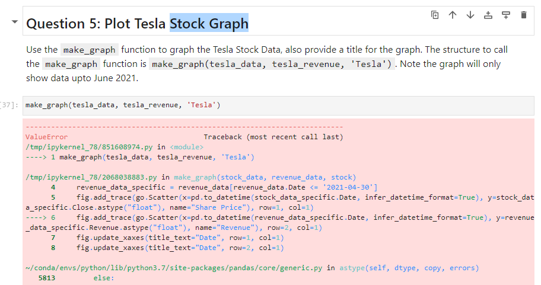
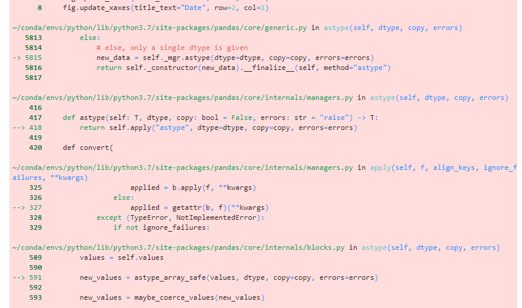
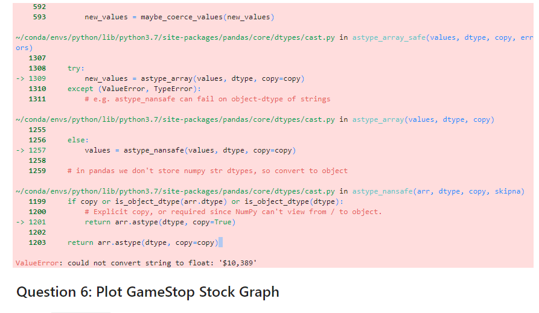

# Stock-Graph
I got the previous questions on code correctly but did not get the creation of graph. Though this is my first encounter with ploting of graph. The following picture is the result of my code after inputting the function. This is the link to my notebook 

Kindly help out. Thank you!
